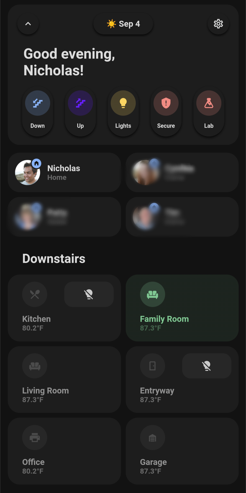

# home-assistant
[](https://pre-commit.com/)
[](https://taskfile.dev/#/)

🏠 My home assistant backup 🤖



---

## :rocket: &nbsp; TL;DR

```
cp .env.tmpl .env
# Update .env
# Update .sop.yaml to include the age public key id
docker compose up -d
```

---

## :electric_plug: &nbsp; Ports

| Container       | Port  |
|-----------------|-------|
| Home Assistant  | 8123  |
| ESPHome         | 6052  |
| Node-RED        | 1880  |
| Code Server     | 8443  |
| Uptime Kuma     | 3001  |
| Portainer       | 9443  | 
| Dozzle          | 8081  |

---

## :key: &nbsp; SOPS

[SOPS][14] is used to encrypt files that contain secrets. The encrypted copy of the file ends in `*.enc`.

```shell
# sops-age = lpass entry name
# att-2571789250549588435-38084 = lpass attach id of keys.txt in sops-age entry
mkdir -p ~/.config/sops/age
lpass show sops-age --attach=att-2571789250549588435-38084 -q > ~/.config/sops/age/keys.txt
# or
age-keygen -o ~/.config/sops/age/keys.txt
sops -e --input-type yaml --output-type yaml ./ha/secrets.yaml > ./ha/secrets.yaml.enc
sops -d --input-type yaml --output-type yaml ./ha/secrets.yaml.enc > ./ha/secrets.yaml
```

---

## :pencil: &nbsp; Notes

- My setup is using the [UI Lovelace Minimalist theme][15].

---

## :hammer_and_wrench: &nbsp; Hardware

- [Intel NUC NUC10i3FNK][12]
- [Samsung SmartThings Hub Gen3 (Z-Wave)][11]
- [SkyConnect (ZigBee)][13]
- [Aeotec Range Extender 7 (Z-Wave)][10]
- [Minoston Z-Wave Outlet Mini Plug-in Socket][7]
- [Innr Zigbee Smart Plugs][2]
- [GE Enbrighten Z-Wave Plus Smart Light Switch][1]
- [Enbrighten 14298 Z-Wave Plus Plug-In Outdoor Smart Switch, Gen5][3]
- [Aeotec Recessed Door Sensor Gen5][4] 
- [GE 12730 Z-Wave Smart Fan Control][5]
- [Aeon Labs Aeotec Z-Wave Door/Window Sensor, 2nd Edition][6]
- [Aqara Door and Window][8]
- [Enbrighten Zigbee Smart Light Switch Outdoor Plug-In][9]

---

## ​:balance_scale:​&nbsp;​ License

​[​Apache License 2.0](./LICENSE)

---

## ​:pencil:​&nbsp;​ Author

​This project was started in 2023 by [​Nicholas Wilde​](https://github.com/nicholaswilde/).

[1]: <https://www.amazon.com/gp/product/B01M1AHC3R/>
[2]: <https://www.amazon.com/gp/product/B07SQGG8Z7/>
[3]: <https://www.amazon.com/gp/product/B07VFQBBJS>
[4]: <https://www.amazon.com/gp/product/B0151Z49BO>
[5]: <https://www.amazon.com/gp/product/B00PYMGVVQ>
[6]: <https://www.amazon.com/gp/product/B00DJALAIE/>
[7]: <https://www.amazon.com/gp/product/B08LN2NPZ3/>
[8]: <https://www.amazon.com/gp/product/B09TP7VMKB/>
[9]: <https://www.amazon.com/gp/product/B0842B57S3/>
[10]: <https://www.amazon.com/gp/product/B081G97TLB/>
[11]: <https://www.amazon.com/gp/product/B07FJGGWJL/>
[12]: <https://www.amazon.com/Intel-NUC-10-Performance-Kit/dp/B083GGZ6TG/>
[13]: <https://www.seeedstudio.com/Home-Assistant-SkyConnect-p-5479.html>
[14]: <https://github.com/getsops/sops>
[15]: <https://ui-lovelace-minimalist.github.io/UI/>
